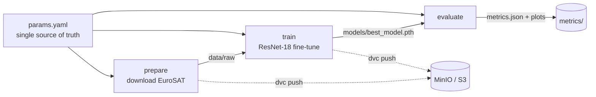

# TerraOps — MLOps Platform for Satellite Land-Use Classification

Turning a trained model into a **reproducible, versioned, and governed system**.

TerraOps industrializes an already-trained satellite image classifier (EuroSAT /
Sentinel-2, ResNet-18, **97.8% test accuracy**) into a full MLOps platform. The model is
*not* the subject — everything **around** it is: reproducibility, data/version lineage,
governance, serving, and monitoring.

> **Design principle:** the model is frozen. TerraOps is about the engineering that makes
> a model trustworthy in production, not about squeezing out more accuracy.

---

## Roadmap

| Sprint | Focus | Tools | Status |
|--------|-------|-------|--------|
| **1** | Data versioning + reproducible pipeline | **DVC**, MinIO | ✅ Done |
| 2 | Experiment tracking + model registry + promotion gate | MLflow | ⏳ Planned |
| 3 | Inference API + interactive map | FastAPI, Streamlit | ⏳ Planned |
| 4 | Monitoring (drift) + CI/CD + retraining | Prometheus, Evidently | ⏳ Planned |

---

## Sprint 1 — The DVC Pipeline

A three-stage DAG turns raw data into an evaluated model with a single command
(`dvc repro`). DVC hashes each stage's dependencies, parameters, and outputs, so a stage
re-runs **only** when something it depends on actually changes.



**Key properties**

- **Single source of truth** — every hyperparameter lives in `params.yaml`; no magic
  numbers in code, so DVC can detect any change and re-run the impacted stages.
- **Scoped parameters** — each stage declares only the params that affect its output
  (changing `evaluate.batch_size` re-runs *only* `evaluate`).
- **Data & models out of Git** — Git stores lightweight `.dvc` pointers; the bytes live in
  a MinIO (S3-compatible) remote, fetched with `dvc pull`.
- **Split secrets** — the remote address is committed (`.dvc/config`); credentials stay in
  gitignored `.dvc/config.local`.

**Reproducibility guarantees**

- Fixed seeds across `torch` / `numpy` / `random`, cuDNN deterministic mode.
- A single global seed shared by `train` and `evaluate` → identical train/val/test split
  (no data leakage between training and evaluation).
- Exact pinned dependency versions (`==`) in `requirements.txt`.

---

## Getting Started

### Prerequisites
- Python 3.12
- Docker (for the MinIO remote)

### 1. Install
```bash
git clone https://github.com/D-Arslan/terraops.git
cd terraops
pip install -r requirements.txt
```

### 2. Start the DVC remote (MinIO)
```bash
docker compose up -d                      # MinIO on :9000 (API) / :9001 (console)
# create the bucket `terraops-dvc` via the console at http://localhost:9001
# then provide your credentials (kept out of Git):
dvc remote modify --local minio access_key_id     <your-key>
dvc remote modify --local minio secret_access_key <your-secret>
```

### 3. Reproduce
```bash
dvc pull      # fetch dataset + model from the remote (fast), OR
dvc repro     # rebuild the whole pipeline from scratch (prepare -> train -> evaluate)
```
`dvc repro` a second time does nothing — DVC recognises the outputs are up to date.

---

## The Model (frozen reference)

Transfer learning on EuroSAT: ResNet-18 pretrained on ImageNet, `layer4` + head fine-tuned.

| Metric | Value |
|--------|-------|
| Test accuracy | **97.80%** |
| Macro F1 | 0.9779 |
| Classes | 10 (AnnualCrop, Forest, River, SeaLake, …) |
| Dataset | 27,000 Sentinel-2 images (64×64 RGB) |

---

## Project Structure

```
terraops/
├── params.yaml            # all hyperparameters (single source of truth)
├── dvc.yaml               # the pipeline DAG: prepare -> train -> evaluate
├── dvc.lock               # pinned hashes of the last successful run
├── docker-compose.yml     # MinIO (DVC remote)
├── requirements.txt       # pinned dependencies
├── src/
│   ├── prepare.py         # materialize the raw dataset
│   ├── dataset.py         # loading, seeded split, transforms
│   ├── model.py           # ResNet-18 transfer learning
│   ├── train.py           # training loop + early stopping
│   ├── evaluate.py        # metrics, confusion matrix, error analysis
│   └── utils.py           # params loading, seeding, logging
├── data/raw/              # dataset (DVC-tracked, not in Git)
├── models/                # trained model (DVC-tracked)
├── metrics/               # metrics.json + plots (Git-tracked)
└── learning.md            # learning log (concepts, decisions, interview prep)
```

---

## Tech Stack

`PyTorch` · `DVC` · `MinIO` (S3) · `Docker` · `scikit-learn` — *MLflow, FastAPI, Streamlit,
Prometheus & Evidently to come.*
